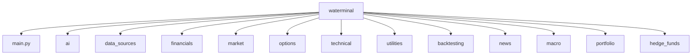

# waterminal financial suite 🚀

A work-in-progress comprehensive financial analysis toolkit for terminal enthusiasts. This project is strictly for educational purpose only. 💹

## Installation 🛠️

```bash
git clone https://github.com/wanazhar/waterminal.git
cd waterminal
python -m venv .venv
source .venv/bin/activate  # Linux/Mac
# .venv\Scripts\activate  # Windows
pip install -r requirements.txt
```

## Configuration ⚙️

```bash
python -m utilities.setup_wizard
```

## Usage 🚀

```bash
python main.py
```

## Key Features ✨

1. Real-time market monitoring 📈
2. Advanced options analysis 🔍
3. Macroeconomic dashboards 🌐
4. AI-powered research assistant 🤖
5. Portfolio backtesting 📊

## Module Structure 🗂️



## API Keys Required 🔑

- Alpha Vantage
- OpenRouter
- FRED (St. Louis Fed)
- EODHD (optional)

## Adding New Modules

- Create a new Python file in the appropriate directory. 🗃️
- Implement core functionality. 💡
- Register in `config/menu_config.py`. 📝
- Add to requirements if needed. 📦

## Contribution 🤝

- Fork the repository. 🍴
- Create a feature branch. 🌱
- Submit a PR with a detailed description. 🚀

## Beginner's Guide 📚

### Getting Started

1. **Clone the Repository**: Start by cloning the repository to your local machine.
   ```bash
   git clone https://github.com/wanazhar/waterminal.git
   ```

2. **Set Up the Environment**: Navigate into the project directory and set up a virtual environment.
   ```bash
   cd waterminal
   python -m venv .venv
   source .venv/bin/activate  # For Windows use .venv\Scripts\activate
   ```

3. **Install Dependencies**: Install the necessary Python packages.
   ```bash
   pip install -r requirements.txt
   ```

4. **Configure API Keys**: Ensure you have all required API keys set up in a `.env` file in the root directory.
   ```
   ALPHA_VANTAGE_KEY=your_alpha_vantage_key
   OPENROUTER_KEY=your_openrouter_key
   FRED_KEY=your_fred_key
   EODHD_KEY=your_eodhd_key
   ```

5. **Run the Setup Wizard**: Execute the setup wizard to complete initial configuration.
   ```bash
   python -m utilities.setup_wizard
   ```

6. **Launch the Application**: Start the application using the main entry point.
   ```bash
   python main.py
   ```

### Understanding the Interface

- **Main Menu**: Navigate through various financial tools and analyses.
- **AI Assistant**: Interact with the AI-powered assistant for financial insights.
- **Portfolio Management**: Track and analyze your investment portfolio.

### Troubleshooting

- **Common Issues**: Refer to the `logs/` directory for error logs if you encounter any issues.
- **Support**: Reach out via the project's GitHub issues page for help.

### Learning Resources

- **Python Basics**: Familiarize yourself with Python programming.
- **Financial Markets**: Gain a basic understanding of financial markets and instruments.
- **Rich Library**: Explore the Rich library for creating beautiful terminal applications.

---

This guide aims to help beginners set up and explore the Waterminal project effectively. For more detailed information, refer to the module-specific documentation within the codebase.

## Step-by-Step Tutorial 🧑🏫

### Basic Usage Walkthrough
```bash
# Start the application
python main.py

# Example workflow:
1. Select 'Core Features' → 'Live Market Data'
2. Enter ticker symbols: AAPL,MSFT
3. View real-time price updates
4. Press Q to return to main menu
5. Select 'AI Assistant' for market insights
```

### Advanced Analysis Example
```python
from portfolio.manager import PortfolioManager

pm = PortfolioManager()
pm.add_position('AAPL', 100, 150.25)
print(pm.performance_report())
```

### Troubleshooting Guide
| Symptom | Solution |
|---------|----------|
| Missing API Keys | Run `python -m utilities.setup_wizard` |
| Data Loading Issues | Check `config/data_sources.json` |
| Module Not Found | Verify `requirements.txt` installation |

