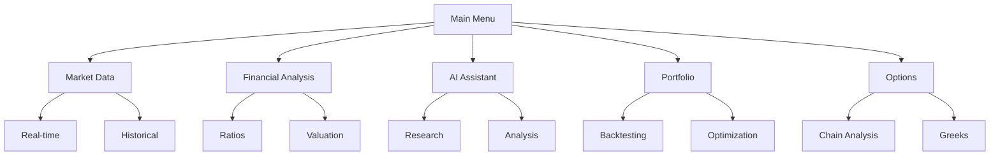

# waterminal finance suite 🚀

A work-in-progress comprehensive financial analysis toolkit for terminal enthusiasts. 💹

## Installation 🛠️

```bash
git clone https://github.com/wanazhar/waterminal.git
cd waterminal
python -m venv .venv
source .venv/bin/activate  # Linux/Mac
# .venv\Scripts\activate  # Windows
pip install -r requirements.txt
```

## Configuration ⚙️

```bash
python -m utilities.setup_wizard
```

## Usage 🚀

```bash
python main.py
```

## Key Features ✨

1. Real-time market monitoring 📈
2. Advanced options analysis 🔍
3. Macroeconomic dashboards 🌐
4. AI-powered research assistant 🤖
5. Portfolio backtesting 📊

## Module Structure 🗂️

```
waterminal/
├── main.py
├── ai/
├── data_sources/
├── financials/
├── market/
├── options/
├── technical/
└── utilities/
```

## API Keys Required 🔑

- Alpha Vantage
- OpenRouter
- FRED (St. Louis Fed)
- EODHD (optional)

## Adding New Modules

- Create a new Python file in the appropriate directory. 🗃️
- Implement core functionality. 💡
- Register in `config/menu_config.py`. 📝
- Add to requirements if needed. 📦

## Contribution 🤝

- Fork the repository. 🍴
- Create a feature branch. 🌱
- Submit a PR with a detailed description. 🚀

## Final Implementation Steps 🏁

1. **Create remaining files:**

```
waterminal/
├── options/
│   └── chain.py
├── macro/
│   └── fred.py
├── backtesting/
│   └── engine.py
└── utilities/
    └── setup_wizard.py
```

2. **Install final dependencies:**

```bash
pip install fredapi yfinance pandas-ta
```

3. **Update menu configuration:**

```python
# config/menu_config.py
MENU_STRUCTURE.append({
    'id': 4,
    'label': 'Derivatives Analysis',
    'children': [
        {'id': 41, 'label': 'Options Chain', 'module': 'options.chain'},
        {'id': 42, 'label': 'Futures Data', 'module': 'market.futures'}
    ]
})
```

## System Architecture Overview 🏗️


```
